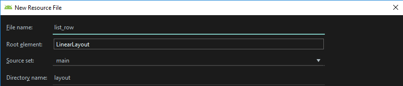
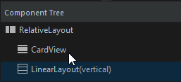
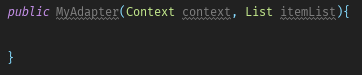

# Basic Recyler View Usage

1. Add RecyclerView inside xml
2. Customize each row
3. Add Adapter
4. Connect adapter and recycler view

## Add RecyclerView inside xml
* Start by adding RecyclerView inside UI
    
    

* Add id to RecyclerView UI component

##  Customize each row(with separate xml file that will be infated into actual view)



* Make it Relative Layout
    * Add Cardview
    * Add Linear Layout to stack it from top down or left to right
    
         
    * Compelete your row design
         
        ````xml
        <?xml version="1.0" encoding="utf-8"?>
        <RelativeLayout xmlns:android="http://schemas.android.com/apk/res/android"
            android:orientation="vertical"
            android:layout_width="match_parent"
            android:layout_height="wrap_content">

            <android.support.v7.widget.CardView
                android:layout_width="match_parent"
                android:layout_height="wrap_content">
                <LinearLayout
                    android:layout_width="match_parent"
                    android:layout_height="match_parent"
                    android:orientation="vertical">
        
                    <TextView
                        android:id="@+id/title"
                        android:layout_width="wrap_content"
                        android:layout_height="wrap_content"
                        android:layout_weight="1"
                        android:fontFamily="cursive"
                        android:textStyle="bold"
                        android:padding="14dp"
                        
                        android:text="@string/welcome_to_lorem_ipsum"
                        android:textSize="24sp" />
        
                    <TextView
                        android:id="@+id/description"
                        android:layout_width="wrap_content"
                        android:layout_height="wrap_content"
                        android:layout_weight="1"
                        android:fontFamily="monospace"
                        android:padding="7dp"
                        android:paddingStart="20dp"
                        android:paddingEnd="20dp"
                        android:text="@string/description_long"
                        android:textSize="12sp" />
                </LinearLayout>
            </android.support.v7.widget.CardView>
        </RelativeLayout>
        ````
  
       
## Add Adapter
* Adapter is the bridge between recycler view and the data that we're gonna be using to feed recycler view.
* MVC = Model View Controller 
    * Create Packages to put each type into its own package so that Models are in one place, Controllers are in one place ...
        
              
    
* Create Adapter

    

* Extend RecyclerView.Adapter<TheNameYouPutToTheAdapter.ViewHolder> and implement required methods(for now empty implementation)
    * do not worry about ViewHolder inner class for now.
    
    

* Create constructor
    
    

* Create ListItem class in Model package

    

    * Since ListItem represents a row item inside our design, we need to add fields that we've added to user interface
        * Remember we added TextView title and description
    
        ````java
        package Model;
        
        public class ListItem {
            private String title;
            private String description;
        
            public ListItem(String title, String description) {
                this.title = title;
                this.description = description;
            }
        
            public String getTitle() {
                return title;
            }
        
            public void setTitle(String title) {
                this.title = title;
            }
        
            public String getDescription() {
                return description;
            }
        
            public void setDescription(String description) {
                this.description = description;
            }
        }
        ````
* Go back to adapter and add required fields and complete the constructor that we've previously started to construct
    
          

* Create inner ViewHolder class inside you adapter class.
    * ViewHolder will hold all of the items inside list_row.xml that we've designed in user interface. 
    

* Extend RecyclerView.ViewHolder and create matching constructor with it.

    
    
* Next we need to do is inflate
    * In order our list_row.xml to be shown inside of our application we need to inflate it.
    * When an xml file inflated, android goes head and takes this xml file and makes it a user interface item that we can interact with. 
        * "Inflation" is a term that refers to parsing XML and turning it into UI-oriented data structures
        * That's it the inflating act.
    * This happens inside onCreateViewHolder
        * Once that is inflated then we return it as if a ViewHolder with all of its properties.
* The code after we've inflated the list_row.xml(see onCreateViewHolder method)
    ````java
    package Adapter;
    
    import android.content.Context;
    import android.support.annotation.NonNull;
    import android.support.v7.widget.RecyclerView;
    import android.view.LayoutInflater;
    import android.view.View;
    import android.view.ViewGroup;
    
    import com.meshale.recyclerviewtrial.R;
    import java.util.List;
    import Model.ListItem;
    
    public class MyAdapter extends RecyclerView.Adapter<MyAdapter.ViewHolder>{
        private Context context;
        private List<ListItem> itemList;
    
        public MyAdapter(Context context, List itemList){
            this.context = context;
            this.itemList = itemList;
        }
    
        @NonNull
        @Override
        public MyAdapter.ViewHolder onCreateViewHolder(@NonNull ViewGroup viewGroup, int i) {
            View view = LayoutInflater.from(viewGroup.getContext()).inflate(R.layout.list_row, viewGroup, false);
            return new ViewHolder(view);
        }
    
        @Override
        public void onBindViewHolder(@NonNull MyAdapter.ViewHolder viewHolder, int i) {
    
        }
    
        @Override
        public int getItemCount() {
            return 0;
        }
    
        public class ViewHolder extends RecyclerView.ViewHolder{
    
            public ViewHolder(@NonNull View itemView) {
                super(itemView);
            }
        }
    
    }

    ````
* Let's now complete our ViewHolder inner class
    ````java
        public class ViewHolder extends RecyclerView.ViewHolder{
            public TextView title;
            public TextView description;
    
            public ViewHolder(@NonNull View itemView) {
                super(itemView);
                title = itemView.findViewById(R.id.title);
                description = itemView.findViewById(R.id.description);
            }
        }
    ````
* let's compete getItemCount method by returning number of items inside our list by using our list fields' size method.
    ````java      
       @Override
       public int getItemCount() {
            return itemList.size();
       }
    ````
* Now we need to bind ViewHolder with our adapter to show it inside of our recycler view.
   * onBindViewHolder method where we bind them together.         
    ````java        
    @Override
    public void onBindViewHolder(@NonNull MyAdapter.ViewHolder viewHolder, int i) {
        viewHolder.title.setText("Example Title");
        viewHolder.description.setText("Example description is done by using lorem ipsum, lorem ipsum is a way to fill the white space with example text so that it doesn't look like as bad as putting some repeated things...");
    } 
    ````

* Our Adapter
````java
package Adapter;

import android.content.Context;
import android.support.annotation.NonNull;
import android.support.v7.widget.RecyclerView;
import android.view.LayoutInflater;
import android.view.View;
import android.view.ViewGroup;
import android.widget.TextView;

import com.meshale.recyclerviewtrial.R;
import java.util.List;
import Model.ListItem;

public class MyAdapter extends RecyclerView.Adapter<MyAdapter.ViewHolder>{
    private Context context;
    private List<ListItem> itemList;

    public MyAdapter(Context context, List itemList){
        this.context = context;
        this.itemList = itemList;
    }

    @NonNull
    @Override
    public MyAdapter.ViewHolder onCreateViewHolder(@NonNull ViewGroup viewGroup, int i) {
        View view = LayoutInflater.from(viewGroup.getContext()).inflate(R.layout.list_row, viewGroup, false);
        return new ViewHolder(view);
    }

    @Override
    public void onBindViewHolder(@NonNull MyAdapter.ViewHolder viewHolder, int i) {
        viewHolder.title.setText("Example Title");
        viewHolder.description.setText("Example description is done by using lorem ipsum, lorem ipsum is a way to fill the white space with example text so that it doesn't look like as bad as putting some repeated things...");
    }

    @Override
    public int getItemCount() {
        return itemList.size();
    }

    public class ViewHolder extends RecyclerView.ViewHolder{
        public TextView title;
        public TextView description;

        public ViewHolder(@NonNull View itemView) {
            super(itemView);
            title = itemView.findViewById(R.id.title);
            description = itemView.findViewById(R.id.description);
        }
    }

}

````

## Now instantiate our adapter and start putting together recycler view

* Add Fields

````java
    private RecyclerView recyclerView;
    private RecyclerView.Adapter adapter;
    
    @Override
    protected void onCreate(Bundle savedInstanceState) {
        super.onCreate(savedInstanceState);
        setContentView(R.layout.activity_main);

        recyclerView = findViewById(R.id.recyclerViewId);
        recyclerView.setHasFixedSize(true);
    }
````

> RecyclerView size changes every time you add something no matter what. What setHasFixedSize does is that it makes sure (by user input) that this change of size of RecyclerView is constant. The height (or width) of the item won't change. Every item added or removed will be the same. If you dont set this it will check if the size of the item has changed and thats expensive. 

* Set layout manager

````java
recyclerView.setLayoutManager( new LinearLayoutManager(this) );
````

> A LayoutManager is responsible for measuring and positioning item views within a RecyclerView as well as determining the policy for when to recycle item views that are no longer visible to the user. By changing the LayoutManager a RecyclerView can be used to implement a standard vertically scrolling list, a uniform grid, staggered grids, horizontally scrolling collections and more. Several stock layout managers are provided for general use.

* Add List field to store list of ListItem, here we just create dummy ListItems to show.
 ````java
private List<ListItem> list;

//inside onCreate
list = new ArrayList<>();
for(int i = 0; i < 10; i++)
    list.add( new ListItem( "Item " + (i+1),"description") );

````

* initialize adapter field that we've added previously.

````java
adapter = new MyAdapter(this,list);
````

* Go back to MyAdapter's onBindViewHolder method
    * get current item
    ````java
        // i is the  second param of onBindViewHolder, itemList is the field of MyAdapter
        ListItem item = itemList.get(i);
    ````
    * fill title and description according to the data of the item that we're currently working on
    ````java
    @Override
    public void onBindViewHolder(@NonNull MyAdapter.ViewHolder viewHolder, int i) {
        ListItem item = itemList.get(i);
        viewHolder.title.setText(item.getTitle());
        viewHolder.description.setText(item.getDescription());
    }
    ````
* set the adapter to the recyclerview inside mainActivity
````java

public class MainActivity extends AppCompatActivity {
    private RecyclerView recyclerView;
    private RecyclerView.Adapter adapter;
    private List<ListItem> list;

    @Override
    protected void onCreate(Bundle savedInstanceState) {
        super.onCreate(savedInstanceState);
        setContentView(R.layout.activity_main);

        recyclerView = findViewById(R.id.recyclerViewId);
        recyclerView.setHasFixedSize(true);
        recyclerView.setLayoutManager( new LinearLayoutManager(this) );

        list = new ArrayList<>();
        for(int i = 0; i < 10; i++)
            list.add( new ListItem( "Item " + (i+1),"description") );

        adapter = new MyAdapter(this,list);
        recyclerView.setAdapter(adapter);
    }
}
```` 

* RecyclerView up and running

    

* Let's give shadow to our cardViews so that they'll look better

````xml
    <!-- inside of list_row.xml -->
    <android.support.v7.widget.CardView
        android:id="@+id/cardView"
        android:layout_width="match_parent"
        android:layout_height="wrap_content"
        android:layout_margin="@dimen/cardview_compat_inset_shadow">
````

